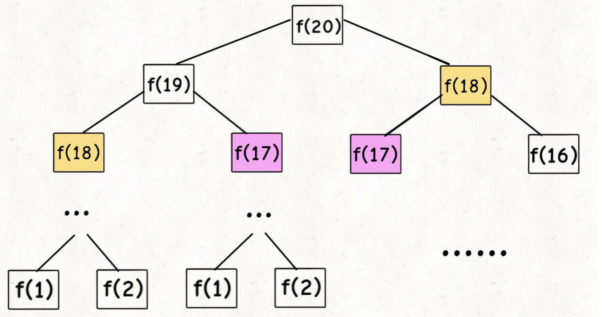
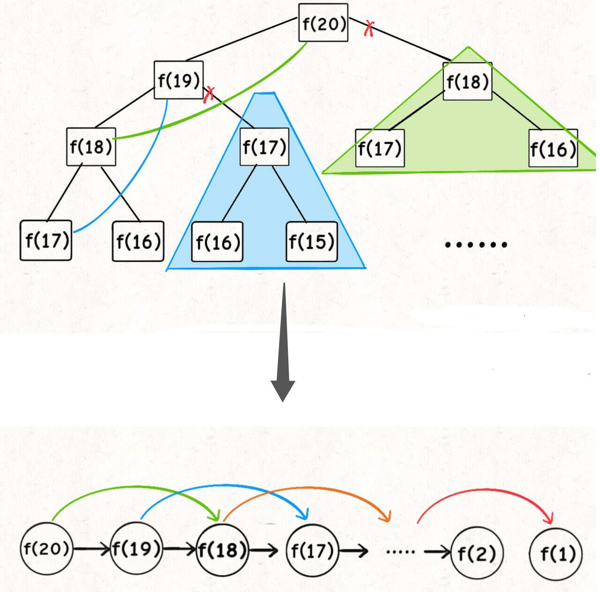
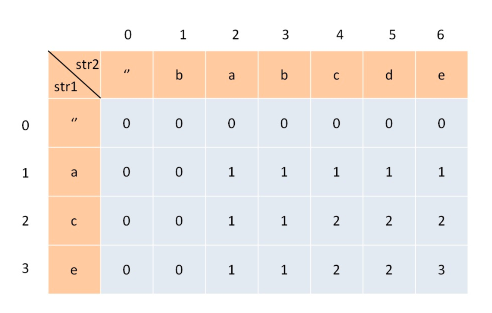

# Dynamic Program (動態規劃)

動態規劃是一種將原問題分解成相對簡單子問題，來求解複雜問題的算法。

## 動態規劃問題的特徵

1. 求最值，例如：最長公共子序列，區間調度等等。

2. 求解動態規劃的基本操作是窮舉（因為要求最值，大部分情況要把所有情況窮舉處理，然後找最值）

3. 三要素：重疊子問題，具備最優子結構，無後效性

4. 解決冗余是根本，用空間換時間

- 重疊子問題：遞迴算法置頂向下對問題求解，每次產生的子問題並不是新的問題，並且會被重複計算。動態規劃針對重複的子問題，只計算一次，把結果存進表格中，再次需要計算時，直接查看表格中先前計算過子問題的答案，從而獲得較高效率，降低時間複雜度。
- 最優子結構：如果問題的最優解所包含的子問題的解也是最優解，並且每個子問題間獨立，我們稱該問題具有最優子結構性質。
- 無後效性：以前的狀態和以前的狀態變化過程，不會影響未來的狀態變化。未來的狀態只能由當前狀態影響。

## 解題思路

1. 明確base case比如Fibonacci series，F(1) = 1, F(2) = 2
2. 明確狀態（原問題與子問題會變化的變量）
3. 明確決策（導致狀態變化的行為）
4. 定義dp數組（原問題與子問題的對應關係）

### 重疊子問題例子

Fibonacci Series

遞迴Fibonacci Series的想像成二叉樹，可以算得時間複雜度為子問題數*一個子問題所需時間，
這裏的二叉樹節點數是2^n-1，時間複雜度是O(2^n)

```js
// 第一版
function fib (n) {
        if (n === 0)    return 0;
        if (n === 1 || n === 2)         return 1;

        return fib(n-1) + fib(n-2);
}

```

```js
// 第二版
function fib (n) {
    if (n === 0)    return 0;

    let memoArray = new Array (n+1).fill(0);
    return fibHelper (memoArray, n);
}

function fibHelper (memoArray, n) {
    if (n === 1 || n === 2)     return 1;

    if (!memoArray[n]) {
        memoArray[n] = fibHelper (memoArray, n-1) + fibHelper (memoArray, n-2);
    }

    return memoArray[n];
}
```

```js
// 動態規劃寫法
// 時間複雜度O(n), 空間複雜度O(n)
var fib = function (n) {
        if (n === 0)    return 0;

        let dp = new Array (n+1).fill(0);

        dp[1] = dp[2] = 1;

        for (let i = 3 ; i <= n ; i++) {
                dp[n] = dp[n-1] + dp[n-2];
        }

        return dp[n];
}
```

```js
// 轉台壓縮，降低空間複雜度 O(1)

var fib = function (n) {
        if (n === 0)    return 0;

        if (n === 1 || n === 2)         return 1;

        let pre = 1;
        let current = 1;

        for (let i = 3 ; i <= n ; i++) {
                let sum = pre + current;
                pre = current;
                current = sum;
        }

        return current;
}

```




優化重疊的子問題，我們可以維護一個數組來記錄已經計算出來的結果，用備忘錄稱之。
時間複雜度降為O(n)

### 零錢兌換

給定不同面額的硬幣 coins 和一個總金額 amount。編寫一個函數來計算可以湊成總金額所需
的最少硬幣個數。如果没有任何一種硬幣組合能組成總金額，返回 -1。

1. base case dp[0] = 0;
2. 明確狀態：原問題與子問題中會變化的變量，目標金額，不斷向base case靠近
3. 明確選擇：導致目標金額變化的行為，在這裡是選擇硬幣
4. 明確dp數組，dp[i]代表目標金額i，所需dp[i]硬幣數

```js

function coinChange (coins, amount) {

        // dp長度聲明amount+1, 包含 amount = 0的解

        let dp = new Array(amount+1).fill(amount+1);
        dp[0] = 0;

        for (let i = 0 ; i < dp.length ; i++) {
                for (let coin of coins) {
                        if (i - coin < 0)   continue;

                        // dp[i]初始化 amount+1 一個不可能的值
                        // 比如輸入[1,2,5], amount = 11
                        // 選擇1: dp[11] = 一個1 + 剩餘需要湊出的dp[11 - 1]的最佳解
                        // 選擇2: dp[11] = 一個2 + 剩餘需要湊出的dp[11 - 2]的最佳解
                        // 選擇5: dp[11] = 一個5 + 剩餘需要湊出的dp[11 - 5]的最佳解
                        // 然後在這三種情況裡找最小的值

                        dp[i] = Math.min (dp[i], dp[i-coin] + 1);
                }
        }

        return (dp[amount] === amount + 1) ? -1 : dp[amount];
}

```

### 最長公共子序列(LCS)二維動態規劃

給定兩個字符串，text1和text2，返回這兩個字符串最長公共子序列的長度，若沒有則返回0.

例子 1：text1='abcde', text2='ace'，最長公共子序列3
例子 2：text1='abc', text2='abc'，最長公共子序列3
例子 3：text1='abc', text2='def'，最長公共子序列0



1. base case 索引為0的行和列表示為空字符串，dp[0][j], dp[i][0]為base case
2. dp[i][j]數組，str1[1...i]和str2[1...j]，LCS長度為dp[i][j]
3. 轉移方程，str1和str2的字符串，要嘛在LCS中，要嘛不在
4. 如果某個字符串存在於LCS中，那麼一定存在於str1和str2中
5. str1[i] === str2[j]，那麼這個字符一定存在於LCS中
6. str1[i] !== str2[j]，說明兩個字符必定有一個不存在於LCS中，需要從兩個之中選擇最大的 Math.max(dp[i-1][j], dp[i][j-1])

function longCommonSeries () {

}

## 算法架構

1. DP數組
2. base case
3. 動態轉移方程，明確狀態，明確選擇

