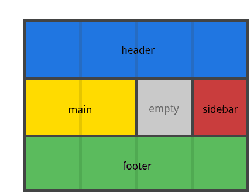

# CSS Basic

## 前端特效瀑布流
https://blog.csdn.net/tridiamond6/article/details/105222289
https://juejin.im/post/5ddb7a7c51882573520fb185

## Webpack 編譯安裝 SCSS 套件
http://www.ruanyifeng.com/blog/2012/06/sass.html


npm install sass-loader node-sass css-loader mini-css-extract-plugin optimize-css-assets-webpack-plugin --save-dev

```js
const MiniCssExtractPlugin = require("mini-css-extract-plugin");
const OptimizeCSSAssetsPlugin = require("optimize-css-assets-webpack-plugin");
const path = require("path");
module.exports = {
  entry: "./packages/src/main.scss",
  output: {
    path: path.resolve(__dirname, "lib")
  },
  module: {
    rules: [
      // Extracts the compiled CSS from the SASS files defined in the entry
      {
        test: /\.scss$/,
        use: [
          {
            loader: MiniCssExtractPlugin.loader
          },
          {
            // Interprets CSS
            loader: "css-loader",
            options: {
              importLoaders: 2
            }
          },
          {
            loader: "sass-loader" // 将 Sass 编译成 CSS
          }
        ]
      }
    ]
  },
  plugins: [
    // Where the compiled SASS is saved to
    new MiniCssExtractPlugin({
      filename: "index.css",
      allChunks: true
    })
  ],
  optimization: {
    minimizer: [
      // 有时候webpack会默认优化z-index值，设置默认不优化
      new OptimizeCSSAssetsPlugin({
        cssProcessorOptions: {
          safe: true
        }
      })
    ]
  }
};
```

## CSS 按需加載

## CSS Basic

### 元素选择器
CSS 樣式表空格表示 DOM 階層式應用

```js
h1 p { font-size 30px }
.important.warning { color: red; font-size 30px } // 有效 class="important warning"
.important .warning { color: yellow; font-size 50px } // 有效 <h1 class="important"><p class="warning"></p></h1>
```

- 子元素選擇器
- 元素選擇器
- 類選擇器
- ID 選擇器
- 屬性選擇器
- 後代選擇器

1. 子元素選擇器
   h1 > strong { color: red }

```js
<h1>This is <strong>very</strong> important topic</h1>  // 有效果
<h1>This is <em>really<strong>very</strong></em> important topic</h1>   // 無效果
```

2. 元素選擇器
   html { color: black }
   p { color: blue }
   h2 { color: silver }

3. 類選擇器
   p.important { color:red }
   h1.important { color:blue }

```js
<h1 class="important">this is important</h1>  // 有效
<p class="important">this is important paragraph</p>  // 有效
<p>this is important paragraph</p>  // 無效
```

4. ID 選擇器
   #intro { color: blue }

```js
<p id="intro">This is topic about security</p> //有效
```

5. 屬性選擇器

```js
a[href][title] {  color: red }
<a href="http://www.google.com" title="Top Web Browser">  //有效
<a>  //無效
```

6. 後代選擇器

h1 em { color: green }

```js
<h1>This is a <em>important</em>topic about security</h1> // 有效
<h1>This is a <strong><em>important</em></strong>topic about security</h1>  // 有效
```
7.
p:before {
  content: 'Happy'
}

```js
<p>我是唐老鸭。</p>
<p>我住在 Duckburg。</p>

<p><b>注释：</b>对于在 IE8 中工作的 :before，必须声明 DOCTYPE。</p>


// Happy我是唐老鸭
```

p:after {
  content: 'Happy'
}

```js
<p>我是唐老鸭。</p>
<p>我住在 Duckburg。</p>

<p><b>注释：</b>对于在 IE8 中工作的 :before，必须声明 DOCTYPE。</p>


// 我是唐老鸭。Happy
```
选择其 class 属性值以 "test" 开头的每个 <div> 元素。
div[class^="test"] {
 background:#ffff00;
}

```js
  <div class="first_test">第一个 div 元素。</div>
  <div class="second">第二个 div 元素。</div>
  <div class="test">第三个 div 元素。</div>
  <p class="test">这是段落中的文本。</p>

// 第一个 div 元素。
// 第二个 div 元素。
// 第三个 div 元素。  背景颜色为黄色
// 这是段落中的文本。

```
选择其 class 属性值以 "test" 结尾的每个 <div> 元素。
div[class$="test"] {
  background:#ffff00;
}

```js
  <div class="first_test">第一个 div 元素。</div>
  <div class="second">第二个 div 元素。</div>
  <div class="test">第三个 div 元素。</div>
  <p class="test">这是段落中的文本。</p>

// 第一个 div 元素。  背景颜色为黄色
// 第二个 div 元素。
// 第三个 div 元素。  背景颜色为黄色
// 这是段落中的文本。

```
选择其 class 属性值以 "test" 包含的每个 <div> 元素。
div[class*="test"] {
  background:#ffff00;
}

```js
  <div class="first_test">第一个 div 元素。</div>
  <div class="second">第二个 div 元素。</div>
  <div class="test">第三个 div 元素。</div>
  <p class="test">这是段落中的文本。</p>

// 第一个 div 元素。  背景颜色为黄色
// 第二个 div 元素。
// 第三个 div 元素。  背景颜色为黄色
// 这是段落中的文本。

```
div,p 所有的div和p标签
div>p 父元素为div的所有p标签
div p div下所有的p标签
div+p 紧接在div后所有的p标签


7. scss css selector
```js
li {
  /* some style 1 */

  &::after {
    /* some style 2 */
  }

}
// 功能等于
li { /* some style 1 */ }
li::after { /* some style 2 */ }
```


## Height
1. 内容区域
100% vs 100vh
div没内容物时，height: 100%, 高度显示为0, 而height: 100vh, 高度显示为整个银幕视窗

## Flex
- container:
  display: flex; (弹性布局)
  flex-direction: row | row-reverse | column | column-reverse; （项目的排列方向）
  flex-wrap: nowrap | wrap | wrap-reverse; （如果一条轴线排不下，如何换行）
  flex-flow: <flex-direction> <flex-wrap>; （flex-direction属性和flex-wrap属性的简写）
  justify-content: flex-start | flex-end | center | space-between | space-around; （项目在主轴上的对齐方式）
  align-items: flex-start | flex-end | center | baseline | stretch; (项目在交叉轴上对齐方式)
  align-content:  flex-start | flex-end | center | space-between | space-around | stretch; (多根轴线的对齐方式)

```js
// 第二个div flexGrow会把 Title div和Input div撑开至最外层的div宽度
<div >
  <div>Title</div>
  <div style={{flexGrow: 1}} />
  <div>Input</div>
</div>
```

item
https://wcc723.github.io/css/2017/07/21/css-flex/
https://www.runoob.com/w3cnote/flex-grammar.html

## Grid
1. 網格容器
2. 網格項
3. 網格線

4. 網格軌道

5. 網格單元

6. 網格區


網格布局


網格容器可設置的屬性
- display  display: grid | inline-grid | subgrid
- grid-template-columns  track-size ... | line-name track-size
- grid-template-rows  track-size ... | line-name track-size
- grid-template-areas
- grid-column-gap line-size  网格单元间距
- grid-row-gap line-size  网格单元间距
- grid-gap  (grid-column-gap 和grid-row-gap縮寫)
- justify-items  start | end | center | stretch
- align-items   start | end | center | stretch
- justify-content  start | end | center | stretch | space-around | space-between | space-evenly
- align-content  start | end | center | stretch | space-around | space-between | space-evenly
- grid-auto-columns
- grid-auto-rows
- grid-auto-flow : row（默认） | column | dense

display: grid | inline-grid | subgrid
grid: 塊級網格
inline-grid: 行內網格
subgrid: 容器本身是網格項（嵌套網格容器)
```js
<div class="container">
  <div class="item item-1"></div>
  <div class="item item-2">
    <p class="sub-item"></p>
  </div>
  <div class="item item-3"></div>
</div>
```


grid-template-columns, grid-template-rows track-size ... | line-name track-size ...
設置行列大小，在行軌道和列軌道兩邊是網格線
track-size: css長度，百分比或fr單位(100px, 20%, 2fr)
line-name: 網格線名稱
設置爲auto時，自動分配名稱和大小
```js
.container{
  display: grid;
  grid-template-columns: 40px 50px auto 50px 40px;
  grid-template-rows: 25% 100px auto;
}

.container{
    display:grid;
    grid-template-columns: [first] 40px [line2] 50px [line3] auto [col4-start] 50px [five] 40px [end];
    grid-template-rows: [row1-start] 25% [row1-end] 100px [third-line] auto [last-line];
}
```


grid-template-areas
網格模板，重復網格區（grid-area）名稱可以跨越網格單元，'.'代表空網格單元。

```js
.item-a{
  grid-area: header;
}
.item-b{
  grid-area: main;
}
.item-c{
  grid-area: sidebar;
}
.item-d{
  grid-area: footer;
}
.container{
    display:grid;
    grid-template-columns: 50px 50px 50px 50px;
    grid-template-rows: auto;
    grid-template-areas: "header header header header"
                         "main main . sidebar"
                         "footer footer footer footer"
}
```



grid-column-gap
網格單元間距
```js
.container{
    display:grid;
    grid-template-columns: 100px 50px 100px;
    grid-template-rows: 80px auto 80px;
    grid-column-gap: 10px;
    grid-row-gap: 15px;
}
```


justify-items:  start | end | center | stretch
垂直於列網格線對齊
- start 
- center 
- end 
- stretch 


align-items: start | end | center | stretch
垂直於行網格線對齊
- start 
- center 
- end 
- stretch 


justify-content: start | end | center | stretch | space-around | space-between | space-evenly
總網格數小於容器網格數時的對齊，垂直於列對齊
- start 
- center 
- end 
- stretch 
- space-around 
- space-between 
- space-evenly 


align-content: start | end | center | stretch | space-around | space-between | space-evenly
總網格數小於容器網格數時的對齊，垂直於行對齊
- start 
- center 
- end 
- stretch 
- space-around 
- space-between 
- space-evenly 


網格項可設置的屬性
- grid-column-start
- grid-column-end
- grid-row-start
- grid-row-end
- grid-column
- grid-row
- grid-area
- justify-self
- align-self

grid-column-start:  number | name | span number | span name | auto
通過網格線來定義網格的位置

line: 指定編號
span <number>: 跨越軌道的數量
span <name>: 跨越軌道直到網格線名字
auto: 自動展示位置


grid-area: name | row-start / column-start / row-end / column-end
定義網格名字


justify-self: justify-self: start | end | center | stretch
定義單個網格項垂直於列網格線的對齊方式


align-self: start | end | center | stretch
定義單個網格項垂直於行網格線的對齊方式

### 图片缩放（img scale）
<https://blog.csdn.net/datou0529/article/details/52040381>

```js
  
```