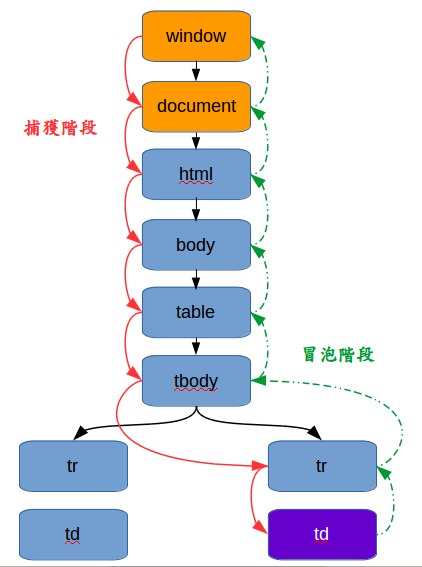

# 事件捕獲，事件目標和時間冒泡  

## DOM事件流（event flow）存在三個階段：事件捕獲階段，事件目標階段，事件冒泡階段

- 捕獲階段：  
當滑鼠點擊或者觸發dom事件時，瀏覽器從根節點流向目標節點，並在各節點觸發捕獲事件，此階段主要是建立傳播路徑，如果父元素注冊事件捕获，會先觸發父元素的綁定事件。
- 目標階段：  
事件到達目標節點，觸發目標節點的事件，然後沿着傳播路徑，逆向回流到文檔根節點。  
- 冒泡階段：  
當一個目標元素接觸發事件時，會把接收到的事件傳給自己的父級直到文檔的根節點window，觸發父元素的事件，若要阻止目標節點的事件冒泡，可以使用stopPropagation()。