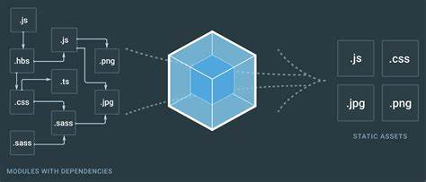

# Webpack Basic

<https://ithelp.ithome.com.tw/articles/10200329?sc=iThelpR>
<https://ithelp.ithome.com.tw/articles/10200459>
<https://ithelp.ithome.com.tw/articles/10212909?sc=rss.qu>
<https://pjchender.github.io/2018/05/17/webpack-%E5%AD%B8%E7%BF%92%E7%AD%86%E8%A8%98%EF%BC%88webpack-note%EF%BC%89/>
<https://andrew-flower.com/blog/Async-Await-with-React>
<https://stackoverflow.com/questions/49602092/webpack-ignores-webpack-config-js>
<https://segmentfault.com/a/1190000012718374#articleHeader9>

## Introduction

前端工程擁有多方便的東西和語法糖，例如 React 的 JSX、ES6 或 CSS 的預處理器 SASS、SCSS 和其他 CoffeeScript 等等，為了把各式各樣的語言編譯成讓瀏覽器看得懂，也許我們能使用 Babel 來處理 JavaScript 的部分，但 SASS 和 SCSS 也需要再另外去編譯成 CSS，而 webpack 可以把全部前端的文件整合成一個檔案。
現代化大型企業前端項目要求：1. 工程化 2. 提高開發效率 3. 復雜數據狀態管理 4. 自動化
項目功能日益復雜龐大，最終變得難以管理，而模塊化能依照功能作代碼劃分，單獨維護，提高開發效率，降低維護成本。
Webpack最重要兩個特性：“Loader” 和 “插件機制”構成webpack無所不能。

## 模塊化的演進

1. 文件劃分：一個模塊用一個script標籤引入，缺點：變量污染，命名衝突，沒有私有空間

2. 命名空間：約定每個模塊只曝露一個全局對象，所有模塊成員都掛載到全局對象

3. IIFE：立即調用函數，透過閉包給予每個模塊私有空間

4. IIFE 依賴參數

## 文件加載

過去HTML透過script標籤加載模塊，這種方式使得模塊加載不受代碼控制，維護十分不方便，更爲理想的方式在頁面中使用一個JS入口文件，其餘模塊透過JS按需加載。

## 模塊化規範

1. CommonJS：NodeJS模塊化規範，屬於同步加載。（環境層）

2. ES Module：JS模塊化規範，屬於異步加載。（語言層）

3. AMD Module：瀏覽器模塊化規範，屬於異步加載。（環境層）

## 前端工程需要解決的問題

1. ES Module模塊系統瀏覽器兼容問題

2. 模塊化文件過多造成請求服務器次數過多，導致運行效率降低

3. 資源文件模塊化

## work flow

1. webpack 通過配置找到入口文件, entry: index.js
2. 從入口文件分析處理項目所有依賴模塊，構建一個依賴關系圖
3. loader module 分析編譯各種資源（js, css, html, png, jpeg...）爲瀏覽器可執行的格式文件
4. 把所有模塊打包爲一個或多個瀏覽器可識別的 JS 文件，默認是 bundle.js

## Step-By-Step

1. npm install webpack webpack-cli(webpack-command) -g
2. webpack -v 成功顯示版本
